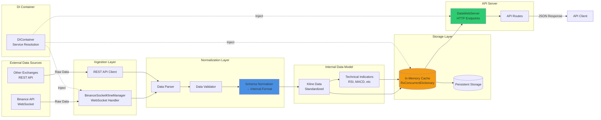

# Coin Data API — Platform Server Design in Practice

## 1. 이 프로젝트의 위치

이 저장소는 [메인 게임 아키텍처](https://github.com/1985jwlee/portpolio_main)에서 제시한 
**"플랫폼 서버(Platform Server)"** 설계 원칙을
**비게임 도메인에서 검증**하기 위한 실증 프로젝트입니다.

### 메인 포트폴리오와의 관계

| 개념 | 게임 서버 (메인) | Coin API (본 프로젝트) |
|------|-----------------|----------------------|
| **실시간 처리 계층** | Game Server (C#) | API Server (C#) |
| **비동기 수집 계층** | Kafka Event Stream | Binance WebSocket |
| **영속화 전략** | MySQL (이벤트 기반) | JSON 정규화 + HTTP |
| **외부 의존성 격리** | DB 장애 시 게임 진행 | 거래소 API 장애 시 제한 제공 |

---

## 2. 설계 목표

메인 포트폴리오에서 제시한 다음 원칙들을 실증:

✅ **외부 의존성 격리**
- 거래소 API 장애가 내부 서비스로 전파되지 않음

✅ **정규화 계층의 분리**
- 외부 포맷 변경이 내부 API 계약에 영향 없음

✅ **플랫폼으로서의 확장성**
- 데이터 소스 추가/제거가 클라이언트에 영향 없음

---

## 3. 핵심 설계 결정

### 3.1 External Data → Internal Schema 변환

```
[ Binance API ]
    ↓ WebSocket
[ Ingestion Service ]
    ↓ 즉시 정규화
[ Internal Schema ]
    ↓ REST API
[ Clients ]
```

**메인 포트폴리오 대응**:
```
[ Game Events ]
    ↓ Kafka
[ Platform Server ]
    ↓ 정규화
[ MySQL Schema ]
```

### 3.2 장애 격리 전략

**거래소 API 다운 시**:
- ❌ 전체 서비스 중단 (하지 않음)
- ✅ 캐시된 데이터 제공 (제한적 운영)
- ✅ 503 대신 200 + stale 플래그

**메인 포트폴리오 대응**:
- Kafka 다운 → 게임은 계속 진행
- MySQL 다운 → 운영 API만 영향

---

## 4. 시스템 아키텍처

### 전체 구성도



---

## 5. 구현 증거

### 5.1 정규화 계층 설계

**외부 API 변경이 내부 서비스에 영향을 주지 않도록 설계**

```csharp
// Binance 외부 응답 → 내부 표준 스키마 변환
public class DataNormalizationService
{
    public InternalIndicatorData Normalize(
        IBinanceKline candle, 
        KlineInterval interval)
    {
        // 1. 외부 포맷 → 내부 표준
        var normalized = new InternalIndicatorData
        {
            Timestamp = candle.OpenTime,
            Interval = MapInterval(interval),
            OHLC = new OHLC 
            {
                Open = candle.OpenPrice,
                High = candle.HighPrice,
                Low = candle.LowPrice,
                Close = candle.ClosePrice
            }
        };

        // 2. 지표 계산 (내부 표준)
        normalized.Indicators = CalculateIndicators(candle);

        return normalized;
    }

    // 외부 Enum → 내부 표준 변환
    private string MapInterval(KlineInterval external)
    {
        // Binance 포맷이 바뀌어도 내부 API는 안정적
        return external switch
        {
            KlineInterval.OneMinute => "1m",
            KlineInterval.FiveMinutes => "5m",
            KlineInterval.FifteenMinutes => "15m",
            _ => "unknown"
        };
    }
}
```

### 5.2 장애 격리 구현

**외부 API 장애 시 서비스 연속성 보장**

```csharp
public class ResilientDataProvider
{
    private readonly BinanceSocketClient _socketClient;
    private readonly DataCache _cache;

    public async Task<IndicatorResponse> GetIndicators(
        string symbol, 
        string interval)
    {
        try
        {
            // 1. 실시간 데이터 시도
            var liveData = await _socketClient
                .GetLatestData(symbol, interval);
            
            if (liveData != null)
            {
                _cache.Update(symbol, interval, liveData);
                return new IndicatorResponse
                {
                    Data = liveData,
                    Status = "live",
                    Timestamp = DateTime.UtcNow
                };
            }
        }
        catch (Exception ex)
        {
            // 2. 실패 시 캐시된 데이터 제공
            var cachedData = _cache.Get(symbol, interval);
            
            if (cachedData != null)
            {
                return new IndicatorResponse
                {
                    Data = cachedData,
                    Status = "stale",
                    Timestamp = cachedData.Timestamp,
                    Warning = "Using cached data due to API failure"
                };
            }

            throw new ServiceUnavailableException(
                "No live or cached data available");
        }
    }
}
```

### 5.3 API 계약 안정성

**클라이언트는 외부 변경과 무관하게 동일한 API 사용**

```csharp
// 내부 표준 API - 외부 데이터 소스와 무관
[HttpGet("api/v1/indicators")]
public async Task<IActionResult> GetIndicators(
    [FromQuery] string symbol,
    [FromQuery] string interval)
{
    // 내부 정규화된 데이터 반환
    var data = await _indicatorService
        .GetNormalizedIndicators(symbol, interval);

    return Ok(new
    {
        symbol,
        interval,
        timestamp = DateTime.UtcNow,
        status = data.Status,
        indicators = data.Indicators
    });
}
```

---

## 6. 트레이드오프 & 의도적 선택

### 선택한 것

✅ **안정성 우선**
- 외부 API 장애를 가정한 설계
- 캐시된 데이터 제공으로 부분 운영

✅ **계약 중심 설계**
- 내부 API는 외부 변경에 독립적
- 클라이언트 영향 최소화

✅ **단순한 구조**
- 초기 복잡도 최소화
- 필요 시 확장 가능한 구조

### 선택하지 않은 것

❌ **실시간 초저지연**
- 도메인 요구사항 아님
- 안정성이 더 중요

❌ **완벽한 데이터 동기화**
- 외부 API는 언제든 실패 가능
- 부분 실패를 정상으로 가정

❌ **초기 과도한 캐싱**
- 메모리 기반 단순 캐시로 충분
- 필요 시 Redis 등 추가 가능

---

## 7. 장애 시나리오 & 대응

### 시나리오 1: Binance API 다운

```
[ 장애 발생 ]
    ↓
[ WebSocket 연결 실패 감지 ]
    ↓
[ 캐시된 데이터로 전환 ]
    ↓
[ API 응답: status="stale" ]
    ↓
[ 클라이언트는 계속 동작 ]
```

**영향**:
- 실시간성 저하 (수 분 정도 지연)
- 서비스 중단 없음

### 시나리오 2: 외부 스키마 변경

```
[ Binance API 스키마 변경 ]
    ↓
[ Normalization Layer에서 흡수 ]
    ↓
[ 내부 API는 변경 없음 ]
    ↓
[ 클라이언트 영향 없음 ]
```

**영향**:
- 내부 변환 로직만 수정
- 클라이언트 재배포 불필요

---

## 8. 기술 스택

### Core
- **언어**: C# (.NET 9.0)
- **프로토콜**: WebSocket + REST
- **라이브러리**: Binance.Net, TALib.NETCore

### Infrastructure
- **Web Server**: WatsonWebserver (경량 HTTP 서버)
- **DI Container**: Microsoft.Extensions.DependencyInjection
- **Serialization**: Newtonsoft.Json

---

## 9. 실행 방법

```bash
# 1. 의존성 복원
dotnet restore

# 2. 서버 실행
dotnet run

# 3. API 테스트
curl "http://localhost:9200/api/v1/summary?symbol=BTCUSDT&interval=1m"
curl "http://localhost:9200/api/v1/oscillators?symbol=ETHUSDT&interval=5m"
curl "http://localhost:9200/api/v1/moving_averages?symbol=ADAUSDT&interval=15m"
```

---

## 10. 메인 포트폴리오와의 연결

이 프로젝트는 메인 게임 서버 아키텍처의 **플랫폼 서버 설계 원칙**이
비게임 도메인에서도 동일하게 적용 가능함을 증명합니다.

### 핵심 메시지

> **"설계 원칙은 도메인을 넘어 일반화 가능합니다."**

| 원칙 | 게임 서버 적용 | Coin API 적용 |
|------|---------------|--------------|
| **외부 격리** | DB 장애 격리 | 거래소 API 격리 |
| **정규화 계층** | Event → DB Schema | External → Internal Schema |
| **계약 안정성** | 운영 API 불변 | 클라이언트 API 불변 |
| **비동기 처리** | Kafka Event Stream | WebSocket Stream |

---

## 11. 다음 단계

이 프로젝트를 통해 검증된 원칙들은 다음으로 확장 가능합니다:

- **다중 거래소 지원**: Binance 외 다른 거래소 추가
- **고급 캐싱**: Redis 기반 분산 캐시
- **모니터링**: 데이터 품질 및 지연 메트릭
- **알림 시스템**: 특정 지표 임계값 도달 시 알림

---

## 12. 라이선스

이 프로젝트는 포트폴리오 목적으로 공개되었습니다.

---

**Last Updated**: 2026-01-15
