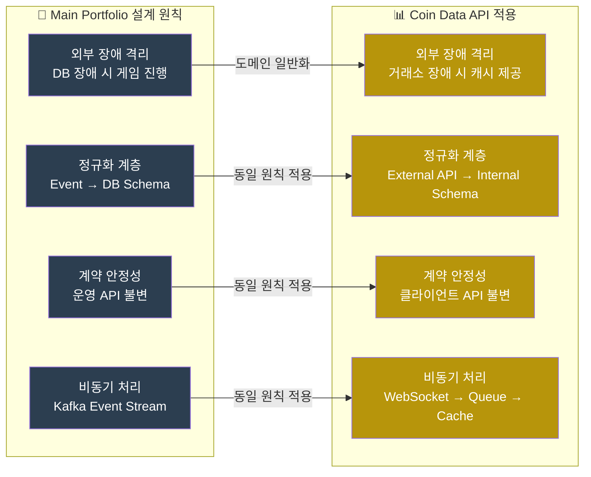
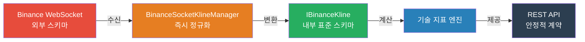
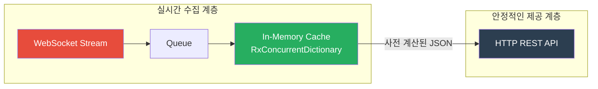
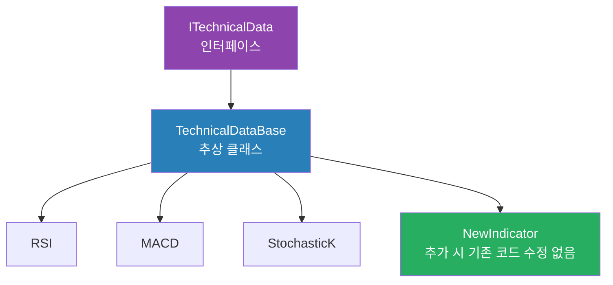
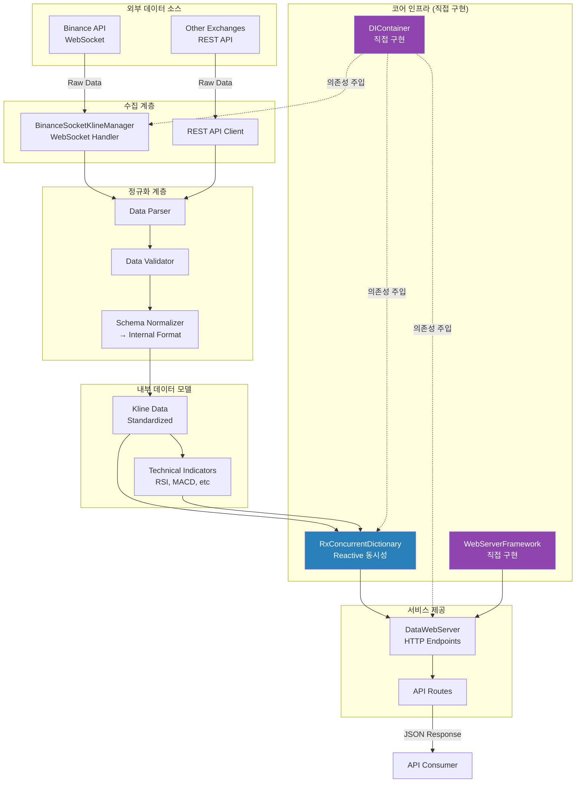
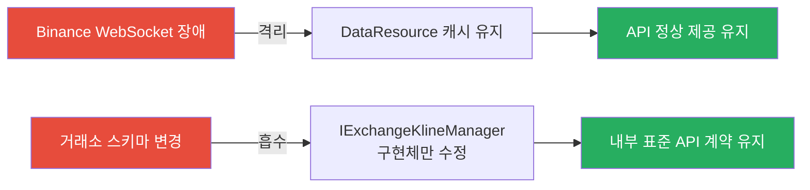
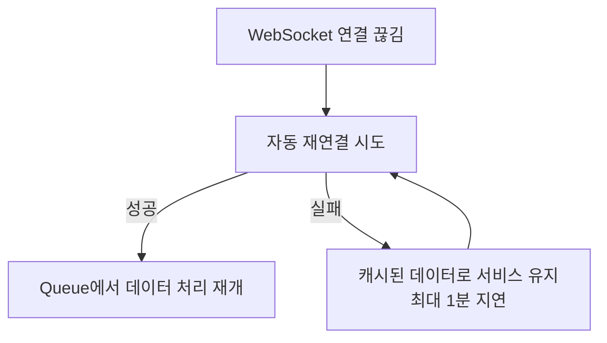

# Coin Data API — Real-time Market Data Platform

> **외부 API 변동성을 흡수하고, 안정적인 내부 계약을 제공하는 데이터 플랫폼**

[](https://github.com/1985jwlee/portpolio_coindataapi)
[](README.md)

---

## 🔗 이 프로젝트의 위치

> **이 프로젝트는 [Event-driven Real-time Game Platform](https://github.com/1985jwlee/portpolio_main)의 설계 원칙이 게임 외 도메인에서도 동일하게 적용됨을 증명하는 포트폴리오입니다.**

### 메인 포트폴리오와의 관계


```mermaid
graph LR
    subgraph Main["🚩 Main Portfolio 설계 원칙"]
        M1[외부 장애 격리\nDB 장애 시 게임 진행]
        M2[정규화 계층\nEvent → DB Schema]
        M3[계약 안정성\n운영 API 불변]
        M4[비동기 처리\nKafka Event Stream]
    end

    subgraph Coin["📊 Coin Data API 적용"]
        C1[외부 장애 격리\n거래소 장애 시 캐시 제공]
        C2[정규화 계층\nExternal API → Internal Schema]
        C3[계약 안정성\n클라이언트 API 불변]
        C4[비동기 처리\nWebSocket → Queue → Cache]
    end

    M1 -->|도메인 일반화| C1
    M2 -->|동일 원칙 적용| C2
    M3 -->|동일 원칙 적용| C3
    M4 -->|동일 원칙 적용| C4

    style M1 fill:#2c3e50,color:#fff
    style M2 fill:#2c3e50,color:#fff
    style M3 fill:#2c3e50,color:#fff
    style M4 fill:#2c3e50,color:#fff
    style C1 fill:#b7950b,color:#fff
    style C2 fill:#b7950b,color:#fff
    style C3 fill:#b7950b,color:#fff
    style C4 fill:#b7950b,color:#fff
```

### 이 프로젝트를 만든 이유

메인 포트폴리오를 설계하면서 한 가지 질문이 생겼다.

> "게임 서버에서 사용한 설계 원칙들이 다른 도메인에서도 유효한가?"

단순히 게임 아키텍처만 설명하는 것은 "게임에만 맞는 특수한 설계"라는 의심을 남긴다.  
그래서 **동일한 설계 원칙을 금융 도메인(실시간 코인 데이터 플랫폼)에 적용**하여 일반화 가능성을 직접 증명했다.

### 이 경험이 메인 포트폴리오를 뒷받침하는 것들

- `IExchangeKlineManager` 인터페이스로 거래소를 교체 가능하게 만든 것이  
  **메인 포트폴리오의 "외부 의존성 격리" 원칙과 동일한 구조임**을 확인했다
- WebSocket → 캐시 → REST API 변환 계층이  
  **Kafka Event Stream → Platform Server → DB 흐름과 같은 사고방식임**을 구현으로 증명했다
- DI 컨테이너와 웹서버 프레임워크를 직접 구현한 것이  
  **"왜 이렇게 설계되었는가"를 라이브러리 없이 설명할 수 있는 능력**을 검증했다

### 검증하는 능력

| Main Portfolio | Coin Data API |
|----------------|---------------|
| 실시간 판정은 메모리에서 즉시 확정 | WebSocket → In-Memory Cache로 즉시 수집 |
| DB 장애가 게임플레이를 막지 않는다 | 거래소 장애가 API 서비스를 막지 않는다 |
| Event → DB Schema 정규화 | External API → Internal Schema 정규화 |
| Kafka 기반 비동기 처리 | WebSocket 수집과 REST 제공 계층 분리 |
| DI 컨테이너로 의존성 제어 | **DI 컨테이너를 직접 구현해 내부 동작 이해** |

### 핵심 메시지

> "설계 원칙은 게임 도메인에만 국한되지 않습니다.  
> 같은 원칙이 금융 도메인에서도 동일하게 작동함을 직접 구현으로 증명합니다."

---

## 📌 Executive Summary

**이 프로젝트가 증명하는 것:**

```
✓ 외부 데이터 소스의 불안정성을 내부에서 격리하는 설계
✓ 실시간 WebSocket 데이터를 REST API로 정규화하여 제공
✓ 거래소 API 장애 시에도 서비스 연속성 보장
✓ 기술 지표 계산 엔진의 모듈화 및 확장 가능한 구조
✓ DI 컨테이너 · 웹서버 프레임워크를 직접 구현하여 프레임워크 내부 원리 체득
✓ 게임 서버 아키텍처 원칙의 금융 도메인 적용 증명
```

**대상 독자**: 핀테크/트레이딩 백엔드 엔지니어, 데이터 플랫폼 아키텍트

**핵심 메시지**:
> "외부 의존성의 변동성을 구조적으로 격리하고, 클라이언트에게 안정적인 계약을 제공합니다."

---

## 📋 목차

1. [이 프로젝트의 위치](#-이-프로젝트의-위치)
2. [Executive Summary](#-executive-summary)
3. [Why This Architecture?](#-why-this-architecture)
4. [3가지 핵심 설계 결정](#-3가지-핵심-설계-결정)
5. [시스템 아키텍처](#-시스템-아키텍처)
6. [핵심 구현](#-핵심-구현)
7. [장애 대응 설계](#️-장애-대응-설계)
8. [의도적으로 하지 않은 것들](#-의도적으로-하지-않은-것들)
9. [API 사용 예시](#-api-사용-예시)
10. [트레이드오프 & 의도적 선택](#-트레이드오프--의도적-선택)
11. [실행 방법](#-실행-방법)
12. [확장 가능성](#-확장-가능성)
13. [한 줄 요약](#-한-줄-요약)

---

## 🎯 Why This Architecture?

### 실시간 금융 데이터 서비스의 구조적 문제

```
🚨 거래소 API 장애 → 전체 서비스 중단
🚨 외부 스키마 변경 → 클라이언트 코드 수정 필요
🚨 WebSocket 재연결 실패 → 데이터 유실
🚨 기술 지표 계산 로직 분산 → 일관성 부재
🚨 다중 거래소 통합 시 복잡도 폭증
```

### 핵심 판단

> **문제의 핵심은 외부 의존성과 내부 서비스의 결합도입니다.**

이 프로젝트는 위 문제를 **계층 분리**로 해결합니다.

---

## 🏗️ 3가지 핵심 설계 결정

### 1️⃣ External Schema → Internal Schema 정규화


```mermaid
flowchart LR
    A["Binance WebSocket\n외부 스키마"] -->|수신| B["BinanceSocketKlineManager\n즉시 정규화"]
    B -->|변환| C["IBinanceKline\n내부 표준 스키마"]
    C -->|계산| D["기술 지표 엔진"]
    D -->|제공| E["REST API\n안정적 계약"]

    style A fill:#e74c3c,color:#fff
    style B fill:#e67e22,color:#fff
    style C fill:#27ae60,color:#fff
    style D fill:#2980b9,color:#fff
    style E fill:#2c3e50,color:#fff
```

**판단 근거:**
- ✅ Binance API 스키마 변경이 클라이언트에 영향 없음
- ✅ 다른 거래소 추가 시 동일한 인터페이스 사용
- ✅ 기술 지표 계산 로직의 재사용성 확보

**실무 시나리오:**
```
Binance API 스키마 변경:
❌ 잘못된 설계: 모든 클라이언트 코드 수정
✅ 이 설계: Normalizer만 수정, 클라이언트 영향 없음
```

---

### 2️⃣ WebSocket → REST API 변환 계층


```mermaid
graph LR
    subgraph Collect["실시간 수집 계층"]
        WS[WebSocket Stream]
        Q[Queue]
        Cache["In-Memory Cache\nRxConcurrentDictionary"]
        WS --> Q --> Cache
    end

    subgraph Serve["안정적인 제공 계층"]
        REST["HTTP REST API"]
    end

    Cache -->|사전 계산된 JSON| REST

    style WS fill:#e74c3c,color:#fff
    style Cache fill:#27ae60,color:#fff
    style REST fill:#2c3e50,color:#fff
```

**판단 근거:**
- ✅ WebSocket 연결 불안정성을 HTTP 계층에서 흡수
- ✅ 클라이언트는 단순한 HTTP GET 요청만 수행
- ✅ 캐시된 데이터로 일시적 장애 대응

**트레이드오프:**

| 방식 | 장점 | 단점 |
|------|------|------|
| WebSocket 직접 제공 | 최소 지연, 실시간성 | 연결 관리 복잡, 클라이언트 부담 |
| **REST API 제공 (선택)** | **단순한 통합, 안정성** | **약간의 지연 (1분 간격 갱신)** |

**결론:** 트레이딩 지표 분석 목적에는 1분 지연 허용 가능

---

### 3️⃣ 기술 지표 계산 엔진의 모듈화


```mermaid
graph TB
    Interface["ITechnicalData\n인터페이스"]
    Base["TechnicalDataBase\n추상 클래스"]

    Interface --> Base

    Base --> RSI["RSI"]
    Base --> MACD["MACD"]
    Base --> Stochastic["StochasticK"]
    Base --> New["NewIndicator\n추가 시 기존 코드 수정 없음"]

    style Interface fill:#8e44ad,color:#fff
    style Base fill:#2980b9,color:#fff
    style New fill:#27ae60,color:#fff
```

```csharp
// 모든 기술 지표는 동일한 계약 준수
public interface ITechnicalData
{
    decimal mainValue { get; }
    StateAction GetStateAction();
    TrendStyle GetTrendStyle();
}

// 신규 지표 추가는 기존 코드 수정 없이 가능
public class NewIndicator : TechnicalDataBase
{
    public override StateAction GetStateAction()
    {
        // 지표별 시그널 로직
    }
}
```

**판단 근거:**
- ✅ 새로운 지표 추가 시 기존 코드 수정 불필요
- ✅ 각 지표의 계산 로직 독립적 유지
- ✅ 테스트 및 검증 용이

---

## 📊 시스템 아키텍처

### 전체 데이터 흐름


```mermaid
graph TD
    subgraph External["외부 데이터 소스"]
        Binance["Binance API\nWebSocket"]
        Exchange2["Other Exchanges\nREST API"]
    end

    subgraph Ingestion["수집 계층"]
        SocketMgr["BinanceSocketKlineManager\nWebSocket Handler"]
        APIClient["REST API Client"]
    end

    subgraph Normalization["정규화 계층"]
        Parser["Data Parser"]
        Validator["Data Validator"]
        Normalizer["Schema Normalizer\n→ Internal Format"]
    end

    subgraph Internal["내부 데이터 모델"]
        KlineData["Kline Data\nStandardized"]
        Indicators["Technical Indicators\nRSI, MACD, etc"]
    end

    subgraph Core["코어 인프라 (직접 구현)"]
        DI["DIContainer\n직접 구현"]
        WEB["WebServerFramework\n직접 구현"]
        RX["RxConcurrentDictionary\nReactive 동시성"]
    end

    subgraph Output["서비스 제공"]
        WebServer["DataWebServer\nHTTP Endpoints"]
        Routes["API Routes"]
    end

    Binance -->|Raw Data| SocketMgr
    Exchange2 -->|Raw Data| APIClient
    SocketMgr --> Parser
    APIClient --> Parser
    Parser --> Validator --> Normalizer
    Normalizer --> KlineData
    KlineData --> Indicators
    KlineData --> RX
    Indicators --> RX
    RX --> WebServer
    WebServer --> Routes

    DI -.->|의존성 주입| SocketMgr
    DI -.->|의존성 주입| WebServer
    DI -.->|의존성 주입| RX
    WEB --> WebServer

    Routes -->|JSON Response| Client["API Consumer"]

    style DI fill:#8e44ad,color:#fff
    style WEB fill:#8e44ad,color:#fff
    style RX fill:#2980b9,color:#fff
```

---

## 🔧 핵심 구현

### 1. DI 컨테이너 직접 구현

```csharp
// 프레임워크 의존 없이 직접 구현한 DI 컨테이너
public class DIContainer
{
    private Dictionary<Type, Func<object>> registrations = new();

    public void Register<TInterface, TImplementation>()
        where TImplementation : TInterface, new()
    {
        registrations[typeof(TInterface)] = () => new TImplementation();
    }

    public T Resolve<T>()
    {
        var factory = registrations[typeof(T)];
        return (T)factory();
    }
}
```

**직접 구현한 이유:**
- 프레임워크가 내부에서 어떻게 동작하는지 이해하기 위해
- 의존성 그래프와 생명주기를 완전히 제어하기 위해
- "라이브러리를 사용할 줄 안다" → "라이브러리 없이 동일한 기능을 만들 수 있다"

### 2. 웹서버 프레임워크 직접 구현

```csharp
// HTTP 파이프라인을 직접 구현한 웹서버
public class DataWebServer
{
    private RxConcurrentDictionary<KlineInterval,
        Dictionary<string, string>> summarystrings;

    // 1분마다 모든 지표 사전 계산
    public async Task PrepareResponseData()
    {
        foreach (var interval in Defines.binanceInterval)
        {
            var summarydict = new Dictionary<string, string>();

            foreach (var ticker in Defines.futureNames)
            {
                await binanceConn.UpdateFutureCandles(ticker, interval);

                // 지표 계산 및 JSON 직렬화
                var summary = webserverStrings.Summary(ticker, interval);
                summarydict.Add(ticker, summary);
            }

            // 캐시 갱신
            summarystrings.TryRxAddOrUpdate(interval, summarydict);
        }

        await Task.Delay(TimeSpan.FromMinutes(1));
    }

    private async Task Summary(HttpContextBase ctx)
    {
        var symbol = ctx.Request.RetrieveQueryValue("symbol");
        var interval = ToolScript.ConvertToInterval(
            ctx.Request.RetrieveQueryValue("interval"));

        if (summarystrings.TryGetValue(interval, out var dict))
        {
            if (dict.TryGetValue(symbol, out var retstr))
            {
                ctx.Response.ContentType = "application/json";
                await ctx.Response.Send(retstr);
            }
        }
    }
}
```

**핵심 포인트:**
- 사전 계산된 JSON 응답 제공으로 요청 시 지연 최소화
- `RxConcurrentDictionary`로 동시성 안전 보장
- 미들웨어 · 라우팅 구조를 직접 구현하여 HTTP 파이프라인 원리 체득

### 3. Reactive 동시성 딕셔너리

```csharp
// 스레드 안전 + 변경 스트림 구독이 가능한 커스텀 자료구조
public class RxConcurrentDictionary<TKey, TValue>
{
    private ConcurrentDictionary<TKey, TValue> inner = new();
    private Subject<(TKey key, TValue value)> changeStream = new();

    public IObservable<(TKey, TValue)> Changes => changeStream.AsObservable();

    public bool TryRxAddOrUpdate(TKey key, TValue value)
    {
        inner.AddOrUpdate(key, value, (_, __) => value);
        changeStream.OnNext((key, value));
        return true;
    }
}
```

**선택 이유:** 동시성(ConcurrentDictionary)과 반응형 변경 알림(Rx)을 단일 자료구조로 결합 필요

---

## 🛡️ 장애 대응 설계

### 장애 격리 흐름


```mermaid
flowchart LR
    A["Binance WebSocket 장애"] -->|격리| B["DataResource 캐시 유지"]
    B --> C["API 정상 제공 유지"]

    D["거래소 스키마 변경"] -->|흡수| E["IExchangeKlineManager\n구현체만 수정"]
    E --> F["내부 표준 API 계약 유지"]

    style A fill:#e74c3c,color:#fff
    style D fill:#e74c3c,color:#fff
    style C fill:#27ae60,color:#fff
    style F fill:#27ae60,color:#fff
```

### 장애 영향도 매트릭스

| 장애 대상 | API 서비스 | 데이터 신선도 | 복구 전략 |
|----------|-----------|--------------|----------|
| Binance WebSocket | 🟢 정상 (캐시 제공) | 🟡 최대 1분 지연 | 자동 재연결 |
| 기술 지표 계산 실패 | 🟡 해당 지표만 누락 | 🟢 정상 | 로그 기록, 다음 주기 재시도 |
| In-Memory Cache | 🔴 서비스 중단 | 🔴 데이터 손실 | 서버 재시작 |
| REST API 서버 | 🔴 서비스 중단 | 🟢 정상 (수집은 계속) | 프로세스 재시작 |

### 장애 복구 전략


```mermaid
flowchart TD
    A["WebSocket 연결 끊김"] --> B["자동 재연결 시도"]
    B -->|성공| C["Queue에서 데이터 처리 재개"]
    B -->|실패| D["캐시된 데이터로 서비스 유지\n최대 1분 지연"]
    D --> B
```

---

## 🚫 의도적으로 하지 않은 것들

| 비선택 | 이유 |
|--------|------|
| Redis, Message Queue 추가 | 이 규모에서 In-Memory Cache로 충분. 필요 시 교체 가능한 구조로 설계 |
| 초저지연 WebSocket 직접 제공 | 지표 분석 목적에 1분 지연 허용. 복잡한 연결 관리 불필요 |
| 완벽한 데이터 동기화 보장 | 안정성이 동기화 완벽성보다 우선. 일시적 지연 허용 |
| 복잡한 인프라 구성 (Docker, Kafka) | 포트폴리오 목적은 설계 원칙 증명. 인프라 복잡도는 이 단계에서 비용 |

> **"지금 필요하지 않으면, 지금 만들지 않는다"**  
> 하지만 필요해질 때 교체 가능한 구조로 만들어 두었다.

---

## 📈 API 사용 예시

### 1. 요약 데이터 조회

```bash
curl "http://localhost:9200/api/v1/summary?symbol=BTCUSDT&interval=1m"

# 응답
{
  "overall_rating": "buy",
  "counted_actions": { "Buy": 15, "Neutral": 8, "Sell": 3 },
  "indicators": [
    { "name": "rsi",  "value": 45.23, "action": "Neutral" },
    { "name": "macd", "value": 123.45, "action": "Buy" }
  ]
}
```

### 2. 이동평균 조회

```bash
curl "http://localhost:9200/api/v1/moving_averages?symbol=ETHUSDT&interval=5m"

# 응답
{
  "overall_rating": "strong buy",
  "counted_actions": { "Buy": 10, "Neutral": 2, "Sell": 1 },
  "indicators": [
    { "name": "ema_7",  "value": 2345.67, "action": "Buy" },
    { "name": "sma_20", "value": 2340.12, "action": "Buy" }
  ]
}
```

### 3. 피봇 포인트 조회

```bash
curl "http://localhost:9200/api/v1/pivots?symbol=ADAUSDT&interval=15m&period=14"

# 응답
{
  "classic":    { "P": 0.4523, "R1": 0.4556, "R2": 0.4589, "S1": 0.4490 },
  "fibonacci":  { "P": 0.4523, "R1": 0.4535, "R2": 0.4547, "S1": 0.4511 }
}
```

---

## 💡 트레이드오프 & 의도적 선택

### ✅ 선택한 것

**안정성 우선**
- 외부 API 장애를 가정한 설계
- 캐시 기반 서비스 연속성 보장

**단순한 구조**
- In-Memory Cache (Redis 등 불필요)
- 단일 서버 구조 (수평 확장 시 고려)

**명확한 계층 분리**
- WebSocket 수집 계층
- 정규화 계층
- API 제공 계층

### ❌ 선택하지 않은 것

**초저지연 실시간** — 1분 갱신 주기로 충분 (지표 분석 목적)

**완벽한 데이터 동기화** — 일시적 지연 허용, 안정성이 더 중요

**과도한 인프라** — Redis, Message Queue 등 추가 의존성 제거, 필요 시 확장 가능하도록 설계

---

## 🚀 실행 방법

### 필수 요구사항

- .NET 9.0 SDK
- (선택) Docker (인프라 확장 시)

### 실행

```bash
# 1. 의존성 복원
dotnet restore

# 2. 서버 실행
dotnet run

# 3. API 테스트
curl "http://localhost:9200/api/v1/summary?symbol=BTCUSDT&interval=1m"
```

### 설정

`DataResource/server_setting.json`:

```json
{
  "host": "localhost",
  "port": 9200,
  "summary_route": "api/v1/summary",
  "pivot_route": "api/v1/pivots",
  "ma_route": "api/v1/moving_averages",
  "oscillator_route": "api/v1/oscillators"
}
```

---

## 🔮 확장 가능성

### Phase 2: 다중 거래소 지원

```csharp
public interface IExchangeKlineManager
{
    Task<bool> Initialize();
    bool GetKlines(string symbol, KlineInterval interval, out List<IKline> klines);
}

// Binance 구현
public class BinanceSocketKlineManager : IExchangeKlineManager { }

// 새로운 거래소 추가 — 기존 코드 수정 없음
public class UpbitKlineManager : IExchangeKlineManager { }
public class BithumbKlineManager : IExchangeKlineManager { }
```

### Phase 3: 분산 캐시

```
[ WebSocket Receivers ] → [ Redis Pub/Sub ] → [ Multiple API Servers ]
```

### Phase 4: 실시간 알림

```
[ Indicator Threshold ] → [ SignalR WebSocket ] → [ Clients ]
```

---

## 🔗 연관 포트폴리오

| 프로젝트 | 연결 포인트 |
|----------|------------|
| [🚩 Main Portfolio](https://github.com/1985jwlee/portpolio_main) | 이 프로젝트의 설계 원칙 출처. 게임 도메인의 원칙을 금융 도메인으로 일반화 |
| [🌡️ Smart Road IoT](https://github.com/1985jwlee/production-iot-backend) | 동일 원칙의 실무 적용 (Adapter, 장애 격리, WebSocket 안정성) |

> **핵심 메시지**: "설계 원칙은 도메인을 넘어 일반화 가능합니다"

---

## 9. 한 줄 요약

> 이 프로젝트는 코인 데이터를 수집하는 서비스가 아니라,  
> **외부 의존성의 변동성을 계층으로 격리하고 안정적인 계약을 제공하는 데이터 플랫폼 설계 증명**이다.

---

## 📧 Contact

**GitHub**: [@1985jwlee](https://github.com/1985jwlee)
**Email**: leejae.w.jl@icloud.com
**Main Portfolio**: [portpolio_main](https://github.com/1985jwlee/portpolio_main)

---

**Last Updated**: 2026-03-04

**Note**: 이 프로젝트는 실제 트레이딩 서비스를 목적으로 하지 않으며,  
**외부 의존성 격리 및 데이터 플랫폼 설계 능력 + 메인 포트폴리오 설계 원칙의 일반화**를 증명하기 위한 포트폴리오입니다.
